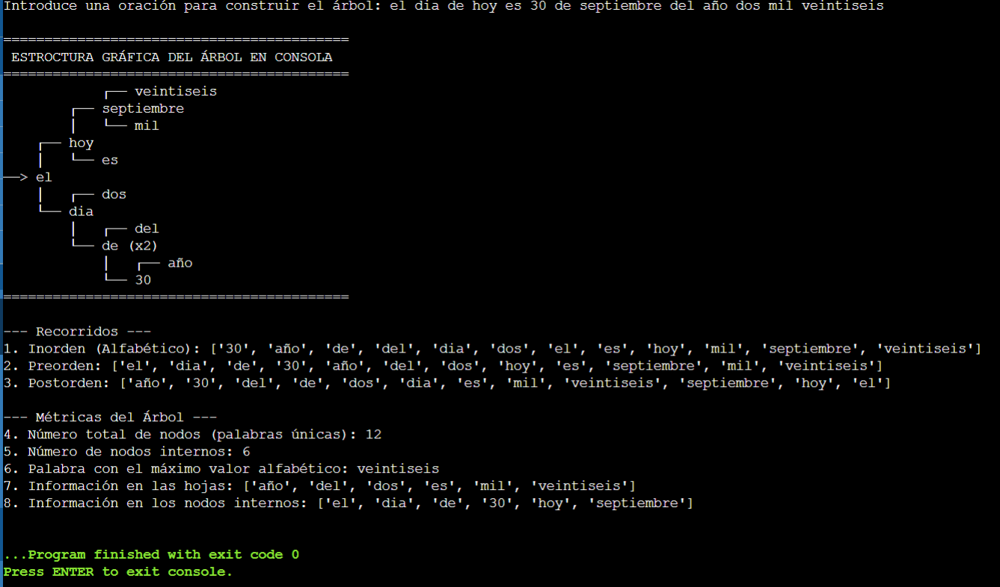

[README.md](https://github.com/user-attachments/files/32871034/README.md)
# Proyecto: Árbol Binario de Búsqueda con Apoyo de IA

**Asignatura:** Estructuras de Datos y Algoritmos  
**Integrantes:** Emilio Jiménez, Diego Gallardo, Doram Basdemir, Alan López 

---

## 1. Descripción del Proyecto
Este programa solicita una oración al usuario, limpia el texto (remueve mayúsculas y puntuación), e inserta cada palabra en un **Árbol Binario de Búsqueda (ABB)**. Posteriormente, calcula recorridos (Inorden, Preorden, Postorden), métricas de nodos y permite analizar las palabras almacenadas.

---

## 2. Diagrama del Árbol Generado
*Oración de prueba utilizada:* `"gato perro casa zorro árbol abeja"`



---

## 3. Registro de Interacción con la IA
Capturas y registro de los prompts utilizados para guiarse durante el desarrollo:

| Pregunta # | Pregunta realizada a la IA | Respuesta obtenida | ¿Se utilizó? | Modificaciones realizadas | Justificación |
| :---: | :--- | :--- | :---: | :--- | :--- |
| **1** | Diseño del nodo | Clase `Nodo` en Python | Sí | Se agregó `frecuencia = 1` | Para manejar duplicados sin romper la estructura de árbol |
| **2** | Inserción y limpieza | `re.sub()` para puntuación | Sí | Ajuste a minúsculas | Evitar nodos duplicados por diferencias de capitalización |
| **3** | Conteo de nodos internos | Función recursiva de conteo | Sí | Ninguna | Algoritmo correcto y eficiente |
| **4** | Casos de prueba límite | Sugerencia de cadenas vacías y símbolos | Sí | Validación inicial en `main()` | Previene errores en tiempo de ejecución |

---

## 4. Casos de Prueba y Resultados

| Caso | Entrada | Aspecto a comprobar | Resultado Esperado | ¿Aprobado? |
| :---: | :--- | :--- | :--- | :---: |
| 1 | `gato perro casa` | Inserción y recorridos | Inorden: `casa`, `gato`, `perro` | Sí |
| 2 | `zorro árbol abeja` | Orden alfabético | Inorden: `abeja`, `árbol`, `zorro` | Sí |
| 3 | `hola` | Árbol con un nodo | Total nodos = 1, Internos = 0 | Sí |
| 4 | `sol sol luna` | Tratamiento de duplicados | Nodos = 2, Frecuencia de `sol` = 2 | Sí |
| 5 | `el 100 y el 2` | Caracteres numéricos (Caso Límite) | Orden correcto según Unicode | Sí |
| 6 | `", . ? !"` | Oración sin palabras (Caso Límite) | Muestra mensaje de alerta | Sí |

---

## 5. Instrucciones de Ejecución
1. Tener instalado Python 3.x.
2. Ejecutar el comando en la terminal:
   ```bash
   python main.py
